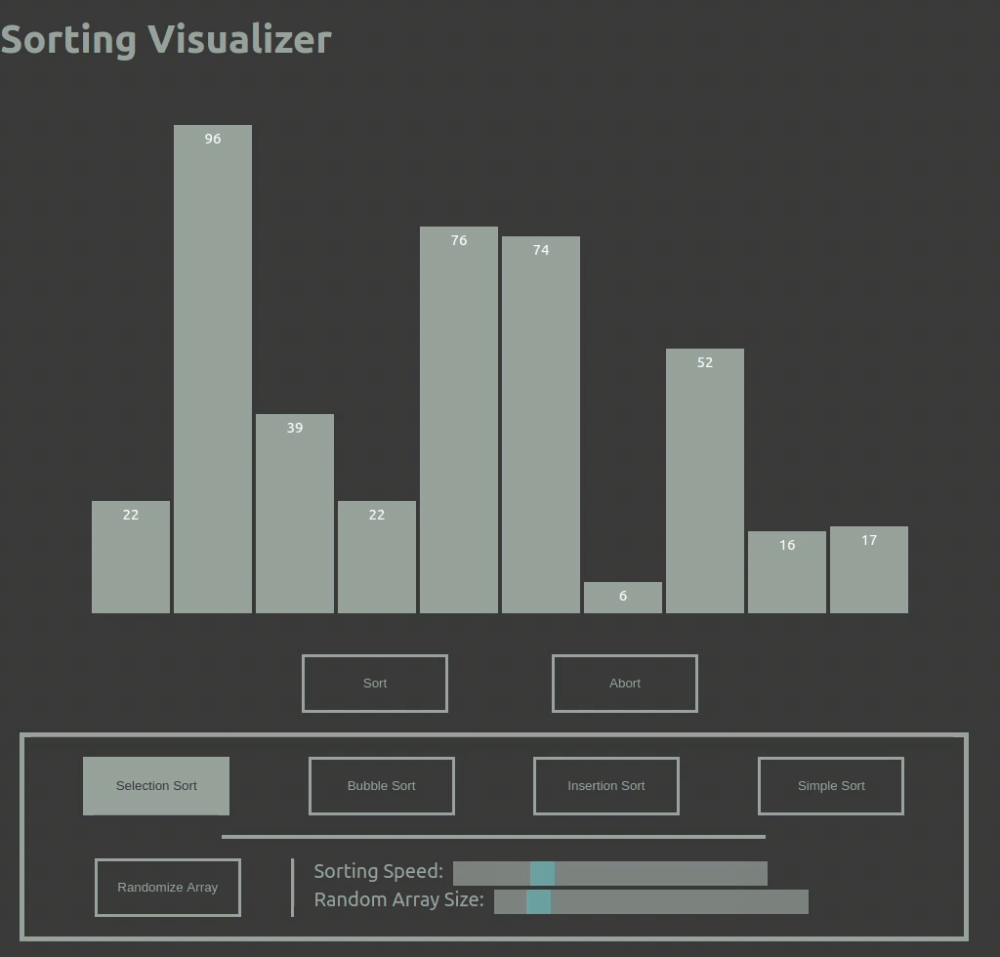

# Sorting Visualizer Project
>This web app take some popular sorting algorithms and visualize them using bar graph and CSS animation.

## Table of Contents
* [Project Demo](#project-demo)
* [Technologies](#technologies)
* [Project Status](#project-status)
* [Future Feature](#future-feature)

## Project Demo
The live demo of this project can be found [here](https://tramy1257.github.io/sorting-visualizer/)

## Technologies
* React.JS
* CSS Animation

## Project Status
This web app is in its basic working version with the following features:

* Choosing among 4 sorting algorithms:
  * Selection Sort
  * Bubble Sort
  * Insertion Sort
  * Simple Sort (Bad Selection)
* Swapping animation while sorting is a big part of this web app.
* Randomizing an array to sort, the size of this array can be changed.
* Changing the sorting speed.

## Future Feature
* Inputing your own array.
* Pause and play sorting animation.
* Step mode which user can click through the sorting process.
* More sorting algorithms: Merge Sort, Quick Sort, Heap Sort, Count Sort
